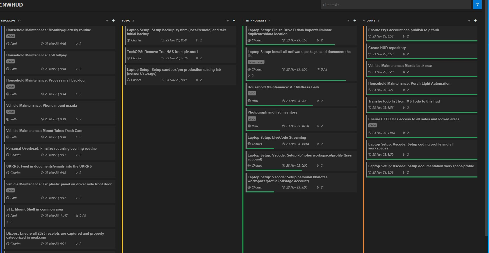

# CNWHUD

## Introduction

Welcome to the CNWHUD repository. This is where Charles N Wyble (aka @ReachableCEO) stores his :

* todo list
* projects
* public notes (works in progress, observations, snippets). Nothing in this repository should be construed as public material statements in relation to the TSYS enterprise.

He is using the following tools:

* [vscode-knbn](https://marketplace.visualstudio.com/items?itemName=gordonlarrigan.vscode-kanbn)
* [knbn](https://github.com/basementuniverse/kanbn)

* [vscode-markwhen](https://marketplace.visualstudio.com/items?itemName=Markwhen.markwhen)
* [markwhen](https://markwhen.com/)

* [vscode-dendron](https://marketplace.visualstudio.com/items?itemName=dendron.dendron)
* [dendron](https://www.dendron.so/)

## What it looks like

## Key links

* My rolling HUD (heads up display) (what I am currently doing as my critical path) [CNWHUD](./.kanbn/index.md)
* (coming within 24 hours) my personal/tsys notes (currently consolidating from apple notes/joplin/text files)
* (coming soon) Markwhen project plan. This will be implemented when I reach the end of my current todo list (projected for 12/10 or so)